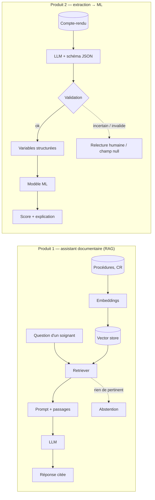

# LLM + documents : RAG ou extraction contrôlée ? — Mini-cours (conception)

> Brief associé : M7-B2
> Durée de lecture : ~25 min
> Pré-requis : notion d'embeddings (M0-B0), LLM (acculturation), bonus RAG M3-B1 si fait

## Pourquoi cette techno ?

« Mettre un LLM sur nos comptes-rendus » peut désigner **deux produits très
différents** :

- un **RAG** (Retrieval-Augmented Generation) **répond à une question** à partir
  d'un corpus : il retrouve les passages pertinents et les donne au LLM, qui
  rédige une réponse. Sa sortie est **du texte pour un humain**.
- une **extraction contrôlée** transforme chaque document en **variables
  structurées** (JSON validé) qu'un autre système exploite — par exemple un
  modèle ML tabulaire. Sa sortie est **une donnée pour une machine**.

Un RAG **ne prédit pas** un risque de séjour prolongé : il n'a ni cible, ni
métrique de classification, ni calibration. Si l'on veut que le texte **améliore
une prédiction**, c'est l'extraction qui fait le travail — et le modèle ML qui
prédit. Confondre les deux, c'est comparer un moteur de recherche à un
classifieur. En M7-B2 on **conçoit** (schéma + coût + risques), on n'implémente pas.

## Concepts clés

- **RAG — composants** : **embeddings** (texte → vecteur) → **vector store**
  (ChromaDB, FAISS) → **retriever** (k passages les plus proches) → **prompt**
  (question + passages + consignes) → **LLM** (réponse ancrée). Fallback naturel :
  **abstention** quand rien de pertinent n'est retrouvé.
- **Extraction contrôlée — composants** : **document** → **LLM avec schéma de
  sortie imposé** (liste fermée de champs, types, valeurs autorisées) →
  **validation** (le JSON respecte-t-il le schéma ? les valeurs sont-elles
  plausibles ? la phrase source est-elle citée ?) → **variables** ajoutées au
  jeu de features → **modèle ML** qui prédit. Un retriever peut servir **à
  l'intérieur** (retrouver le bon passage d'un long document), mais le produit
  n'est pas un RAG.
- **Incertitude et relecture humaine** : une extraction peut être fausse ou
  vide. On prévoit : champ `null` si l'information est absente, **file de
  relecture** pour les extractions incertaines, **échantillon de contrôle**
  relu régulièrement pour mesurer le taux d'erreur d'extraction.
- **Le gain se prouve par ablation** : même modèle **avec** et **sans** les
  variables extraites, même jeu de test, même métrique. Sans ce protocole, « le
  texte va améliorer la prédiction » reste une intuition.
- **Contraintes santé (les deux produits)** : données de santé envoyées où ?
  (API hors UE vs modèle auto-hébergé), traçabilité (quelle version du LLM a
  extrait quelle valeur ?), explicabilité. L'extraction garde un avantage :
  la **décision reste portée par un modèle ML explicable**, et chaque variable
  extraite est **vérifiable** contre sa phrase source.

## Exemple minimal qui tourne

Deux schémas pour **deux produits** — à ne pas mettre dans la même colonne :

## Exercice guidé

Pour MediVox :
1. Hélène parle de « RAG sur les comptes-rendus » pour enrichir la prédiction.
   **Lequel des deux produits** répond à ce besoin ? Justifie en 2 lignes.
2. Propose **3 variables** qu'un compte-rendu pourrait apporter et que le dataset
   administratif n'a pas (ex. : autonomie à la sortie, complication notée).
   Pour chacune : type, valeurs autorisées, que faire si absente ?
3. Décris le **protocole d'ablation** qui prouverait (ou non) le gain.
4. Le produit 1 (assistant documentaire) répond-il à un besoin de MediVox ?
   Si oui, **lequel** — et pourquoi il ne se compare pas au prédicteur.

## Pièges fréquents

| Piège | Conséquence |
|---|---|
| « RAG pour enrichir la prédiction » | Comparaison d'un produit de réponse à un produit de prédiction |
| Faire prédire le LLM directement | Pas de calibration, pas de métrique, explicabilité perdue |
| Extraction sans schéma imposé | Sorties hétérogènes, inexploitables par le modèle |
| Pas de champ `null` ni de relecture | Valeurs inventées injectées dans les features |
| Gain annoncé sans ablation | Argument non défendable |
| Envoyer des données santé à une API hors UE | Risque RGPD majeur |

| Symptôme | Cause probable |
|---|---|
| Colonne B du comparatif sans métrique de prédiction | option B conçue comme un RAG conversationnel |
| Variables extraites « toujours remplies » | le LLM invente au lieu de renvoyer `null` |
| Réponses inventées (RAG) | retriever vide + pas d'abstention |
| Coût qui explose | extraction relancée à chaque prédiction au lieu d'une fois par document |

## Pour aller plus loin

- ChromaDB : https://docs.trychroma.com/
- sentence-transformers : https://www.sbert.net/
- Sorties structurées d'un LLM (JSON schema) — Ollama : https://ollama.com/blog/structured-outputs
- Mini-cours `07_Fine_tuning` : l'exercice « extraction au même format JSON » y est traité côté arbitrage prompt / fine-tune

## Vérification (checklist apprenant)

- [ ] Je distingue **RAG** (réponse pour un humain) et **extraction** (variables pour une machine).
- [ ] Mon option B **prédit avec un modèle ML**, le LLM ne fait qu'extraire.
- [ ] Mon schéma prévoit **validation**, **champ null** et **relecture humaine**.
- [ ] Je décris l'**ablation** qui prouverait le gain.
- [ ] Si je parle d'un assistant RAG, je le présente comme un **autre produit**.

> 💡 **Récap** : un **RAG répond**, une **extraction structure**. Pour enrichir une
> prédiction avec du texte : LLM **extracteur** sous schéma → **validation** (null,
> relecture) → **modèle ML** qui prédit ; gain prouvé par **ablation**. L'assistant
> documentaire RAG est un besoin **distinct**, à qualifier à part.

*Réflexe : avant de dessiner, écris la sortie du système — une phrase pour un humain ou une colonne pour un modèle ?*
