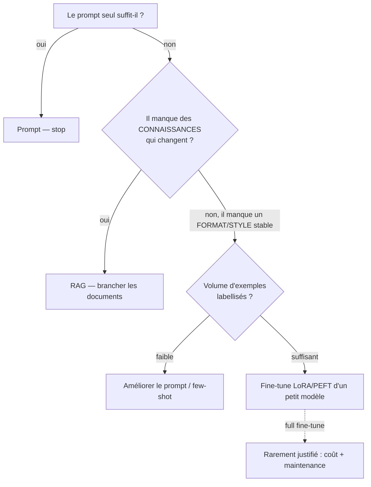

# Fine-tuning — quand, comment, à quel coût — Mini-cours ⭐

> Brief associé : M7-B2
> Durée de lecture : ~25 min
> Pré-requis : `01_3_archis_IA_comparees`, `02_RAG_conception`, `04_Estimation_couts_LLM`
> Statut : **pour aller plus loin** — culture d'arbitrage, on **conçoit**, on n'implémente pas.

## Pourquoi cette techno ?

Prompter, faire du RAG ou **fine-tuner** sont **trois façons différentes**
d'obtenir un comportement d'un modèle. Le RAG lui **donne des documents** à la
volée ; le fine-tuning **modifie ses poids** pour lui apprendre un **format** ou
un **style** de réponse stable. On fine-tune quand la tâche est **répétitive et
cadrée** (ex. extraire toujours le même schéma structuré) et que le prompt seul
n'est pas assez fiable. On **ne** fine-tune **pas** pour ajouter des
connaissances qui changent (ça, c'est le RAG), ni « parce que c'est plus
avancé ». Pour MediVox, retenir surtout **quand ne pas le faire** : sur du
tabulaire, un modèle classique reste le bon verdict.

## Concepts clés

- **Prompt vs RAG vs fine-tune** : prompter (0 entraînement) → RAG (brancher des
  documents) → fine-tune (ré-entraîner des poids). On monte en coût et en
  rigidité à chaque cran. **Toujours essayer le cran le plus bas d'abord.**
- **Full fine-tuning** : on met à jour **tous** les poids. Lourd (GPU 16 Go+),
  cher, difficile à maintenir. Rarement le bon choix en industrialisation.
- **LoRA / PEFT** : on **gèle** le modèle et on n'entraîne que de petits
  **adaptateurs** (quelques % des poids). Même résultat pour une fraction du
  coût GPU et du stockage. **C'est la voie sobre et industrielle** — à préférer
  au full fine-tune dès qu'on doit adapter un modèle.
- **Distillation** : un **gros** modèle (ex. 120B) génère les exemples qui
  entraînent un **petit** modèle (ex. 270M). Le petit modèle **imite** le gros
  sur une tâche précise, pour ~1/400ᵉ de la taille. Argument **sobriété/coût**
  décisif : en production, on sert le petit.
- **SFT (Supervised Fine-Tuning)** : on fournit des paires (entrée → sortie
  attendue) ; le modèle apprend à reproduire la sortie. Outil courant :
  `SFTTrainer` (bibliothèque `trl`).
- **Baseline d'abord** : on mesure le modèle **avant** de fine-tuner (prompt
  seul). Sans cette baseline, impossible de prouver que le fine-tune a servi.

## Exemple minimal qui tourne

Arbre de décision (le cœur pédagogique — pas de code requis) :

## Exercice guidé

MediVox veut **extraire un schéma structuré** (motif, service, durée estimée)
depuis des comptes-rendus libres, toujours au **même format JSON**.

1. Prompt seul, RAG ou fine-tune ? Justifie en 2 lignes.
2. Si fine-tune : full ou **LoRA** ? Pourquoi ?
3. Quelle **baseline** mesures-tu avant de décider ?

> Attendu : le besoin est un **format stable** (pas des connaissances mouvantes)
> → candidat au fine-tune **LoRA** d'un petit modèle, **mais seulement** si le
> few-shot échoue sur une baseline mesurée. Full fine-tune écarté (coût +
> maintenance).

## Pièges fréquents

| Piège | Conséquence |
|---|---|
| Fine-tuner pour ajouter des connaissances qui changent | Modèle vite périmé — c'était un cas RAG |
| Full fine-tune par défaut | Coût GPU + stockage + maintenance injustifiés |
| Sauter la baseline prompt | Impossible de prouver le gain du fine-tune |
| Fine-tuner sur trop peu d'exemples | Sur-apprentissage, gain illusoire |
| Fine-tuner un modèle pour une tâche tabulaire | Sur-engineering — un classifieur suffit |
| Servir le gros modèle en prod | Facture qui explose — distiller puis servir le petit |

| Symptôme | Cause probable |
|---|---|
| Le modèle « oublie » des faits récents | fine-tune utilisé là où il fallait du RAG |
| Facture GPU d'entraînement énorme | full fine-tune au lieu de LoRA/PEFT |
| Gain non démontrable en revue | pas de baseline mesurée avant |
| Bonnes réponses en train, mauvaises en test | trop peu de données / sur-apprentissage |

## Pour aller plus loin

- LoRA / PEFT (Hugging Face) : https://huggingface.co/docs/peft
- `trl` — SFTTrainer : https://huggingface.co/docs/trl
- Tutoriel full fine-tune (Gemma 270M, distillation) — **à lire comme cas
  d'école d'arbitrage**, pas comme modèle à copier :
  https://www.learnhuggingface.com/notebooks/hugging_face_llm_full_fine_tune_tutorial

## Vérification (checklist apprenant)

- [ ] Je distingue **prompt / RAG / fine-tune** et sais lequel monte en coût.
- [ ] Je préfère **LoRA/PEFT** au full fine-tune pour adapter un modèle.
- [ ] Je sais que fine-tune = **format/style**, RAG = **connaissances**.
- [ ] Je mesure une **baseline** avant de décider de fine-tuner.
- [ ] Je reconnais la **distillation** comme argument de sobriété (servir le petit).
- [ ] Je sais dire **quand ne pas fine-tuner** (tabulaire, connaissances mouvantes).

> 💡 **Récap** : trois crans — **prompt → RAG → fine-tune** — coût et rigidité
> croissants ; on essaie le plus bas d'abord. Fine-tune = apprendre un **format
> stable**, pas des connaissances (ça, c'est le RAG). Pour adapter : **LoRA/PEFT**,
> pas full fine-tune. **Distiller** un gros modèle puis **servir le petit** =
> sobriété. Toujours une **baseline** avant. Sur du tabulaire : on ne fine-tune pas.

*Réflexe M7 : le fine-tuning n'est pas « le niveau au-dessus du RAG », c'est un
outil pour un besoin différent (format), à réserver aux cas où le prompt échoue
sur une baseline mesurée.*