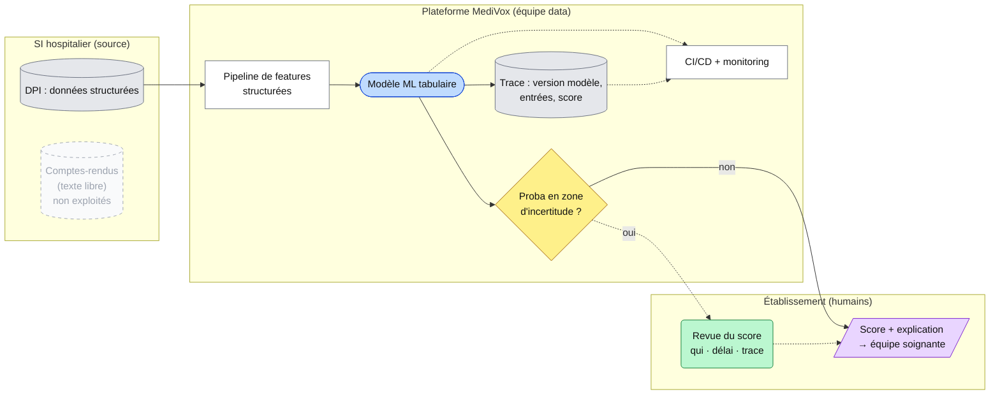

# Option A — ML classique modernisé

> **Légende (commune aux 3 schémas)** : `[( )]` données · `[ ]` traitement codé ·
> `([ ])` modèle ML · `{{ }}` LLM · `{ }` décision / seuil · `( )` humain ·
> `[/ /]` sortie · `-->` flux normal · `-.->` fallback

**Principe** : on garde le modèle ML actuel, entraîné sur les données
structurées du dossier patient, et on l'industrialise : réentraînement et
déploiement automatisés (CI/CD), suivi de ses performances en production
(monitoring), traçabilité de chaque score.

**Force** : simple, sobre (aucun coût par document, pas de GPU), explicable,
et les données de santé ne quittent pas la plateforme. C'est la **référence** à
laquelle B et C doivent prouver un gain.

**Faiblesse** : ignore tout ce qui n'est écrit que dans les comptes-rendus
(autonomie, entourage, complications notées). Les patients dont le profil
dépend de ces infos restent dans la zone d'incertitude.

**Fallback** : quand le modèle hésite, le score est marqué « incertain » et un
humain tranche (même procédure que l'option B : qui, délai, pouvoir, trace).
