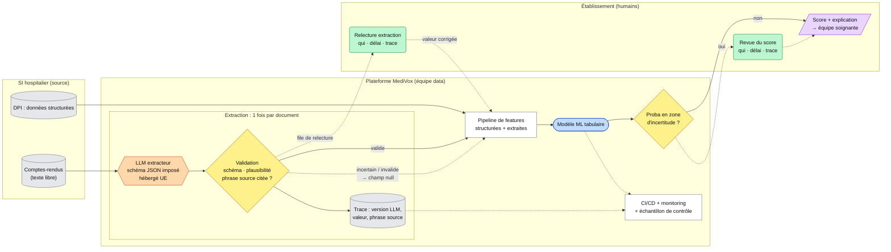

# Option B — Hybride : le LLM extrait, le ML prédit

> **Légende (commune aux 3 schémas)** : `[( )]` données · `[ ]` traitement codé ·
> `([ ])` modèle ML · `{{ }}` LLM · `{ }` décision / seuil · `( )` humain ·
> `[/ /]` sortie · `-->` flux normal · `-.->` fallback

**Principe** : un LLM lit chaque compte-rendu et en extrait une liste de variables, 
sau format JSON imposé. Une fois validées, elles rejoignent les données structurées du dossier patient.

**Force** : exploite l'information du texte libre, absente du dossier, tout en
gardant une décision faite par un modèle ML. Chaque variable
extraite peut être vérifiée contre sa phrase source.

**Faiblesse** : ajoute une stack LLM (coût par document, hébergement de données
de santé, versioning du modèle) et un risque que le LLM hallucine.

**Fallback** : on peut en imaginer deux :
1. **Extraction** : si elle est incertaine ou invalide, on met null, on l'envoie en file de relecture et on
   ne l'injecte jamais telle quelle. On monitore régulièrement pour mesurer le taux d'erreur.
2. **Prédiction** : quand le modèle hésite il est marqué « incertain » et un humain tranche.