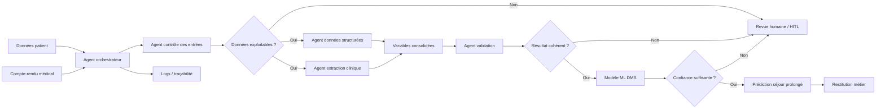

# Option C — Multi-agents

**Principe** : 

Un agent orchestrateur se charge des entrées, et les transmet a un agent de controle qui établit la validité des entrants.
Si les données ne sont pas exploitables, une intervention humaine est requise.

Si les données le sont, alors un agent se charge d'analyser les données structurées (la base de données patient), pendant qu'un autre analyse les rapports écrits.

Les résultats sont transmis a un agent de validation, en charge alors de transmettre des données fiables au modèle ML qui va lui donner une prédiction pour le métier.

**Force** : 
- La modularité
- Gestion de workflows complexes
- Possibilité d'ajouter autant de controles que nécessaire
- Evolutif
- La traçabilité

**Faiblesse** :
- Complexité
- Latence supérieure
- Cout elvé
- Plus de points de panne potentiels
- Audit plus ardu

**Fallback** : 
- Le principal fallback est l'intervention humaine en cas de données insufisantes / incomplètes
- On peut également noter le conflits entre agents, ou le risque d'HITL
